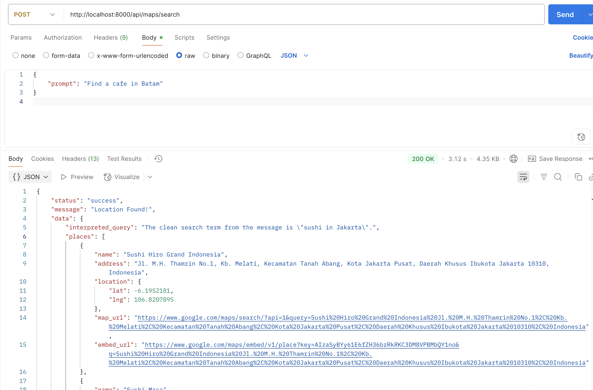
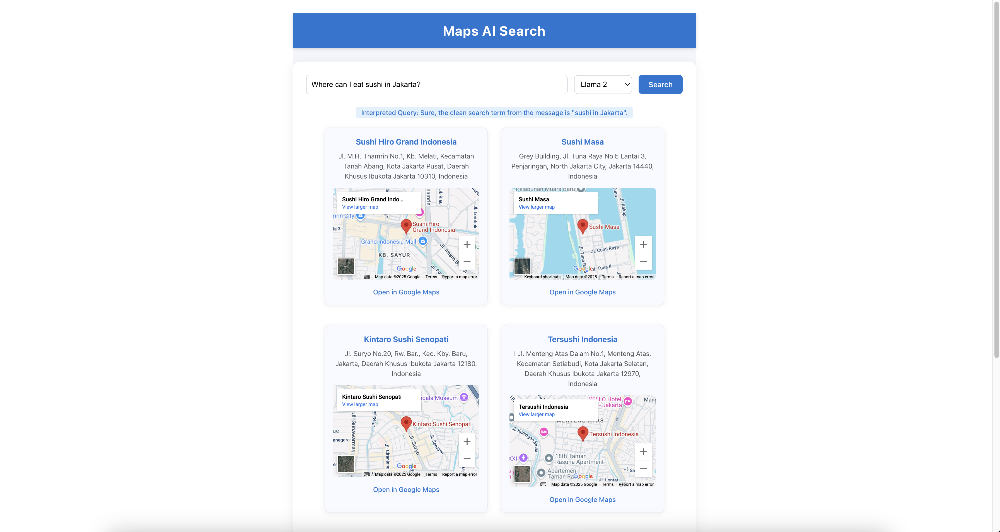

# HeyPico Maps AI Search

A full-stack project that lets users find places to go, eat, or visit using natural language prompts. The app uses a local LLM (Large Language Model) to interpret user queries and the Google Maps API to fetch and display relevant locations, complete with embedded maps and links.

---

## Screenshots

### API Response Example



### UI Interface Example



---

## Features

- Natural language search for places (e.g., "Where can I eat ramen in Batam?")
- Local LLM model selection (Gemma, Llama2, Mistral, etc.)
- Google Maps integration: embedded maps and direct links
- Responsive, modern UI (React + TypeScript)
- Rate limiting and CORS for backend security

---

## Project Structure

```
heypico-technical-test/
  backend/         # Node.js backend (API, LLM, Google Maps integration)
  frontend/        # React + TypeScript frontend (Vite)
  README.md
```

---

## Getting Started

### 1. Clone the Repository

```sh
git clone <repo-url>
cd heypico-technical-test
```

### 2. Backend Setup

- Go to the backend directory:
  ```sh
  cd backend
  ```
- Install dependencies:
  ```sh
  npm install
  ```
- Create a `.env` file with:
  ```
  GOOGLE_MAPS_API_KEY=your_google_maps_api_key
  FRONTEND_ORIGIN=http://localhost:5173
  ```
- Start your local LLM server (e.g., Ollama, Open WebUI) and ensure the endpoint matches your backend code.
- Start the backend:
  ```sh
  npm start
  # or
  node index.js
  ```

### 3. Frontend Setup

- Go to the frontend directory:
  ```sh
  cd ../frontend
  ```
- Install dependencies:
  ```sh
  npm install
  ```
- Create a `.env` file with:
  ```
  VITE_API_BASE_URL=http://localhost:8000/api/maps
  ```
- Start the frontend:
  ```sh
  npm run dev
  ```
- Open [http://localhost:5173](http://localhost:5173) in your browser.

---

## Usage

1. Enter a prompt (e.g., "Find coffee shops near Monas Jakarta").
2. Select the LLM model you want to use.
3. Click "Search".
4. View the top results with embedded Google Maps and direct links.

---

## Environment Variables

### Backend (`backend/.env`)

- `GOOGLE_MAPS_API_KEY` — Your Google Maps API key
- `FRONTEND_ORIGIN` — Allowed frontend origin (e.g., `http://localhost:5173`)

### Frontend (`frontend/.env`)

- `VITE_API_BASE_URL` — The base URL for the backend API (e.g., `http://localhost:8000/api/maps`)

---

## Credits

- [Google Maps Platform](https://developers.google.com/maps)
- [Open WebUI](https://github.com/open-webui/open-webui) / [Ollama](https://ollama.com/) (for local LLM)
- [Vite](https://vitejs.dev/) + [React](https://react.dev/)

---

## License

MIT (or specify your license here)
