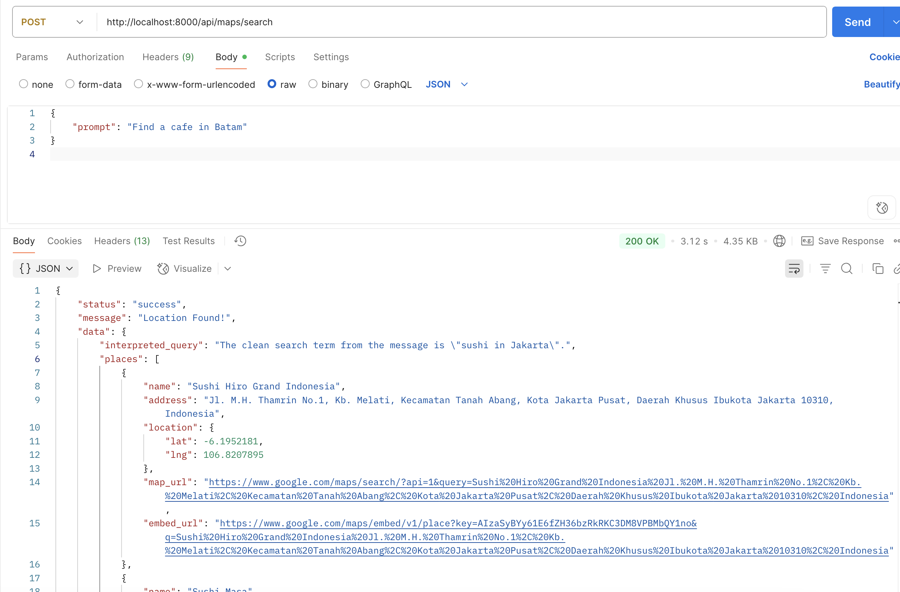

# Project Overview

This is my submission for the HeyPico backend technical assessment. The project consists of a Node.js backend that connects to the Google Maps API and a simple web interface using OpenUI for testing.

## Tech Stack

- Node.js
- Express.js
- Google Maps API
- OpenUI
- LLM (Gemma:2d via Open WebUI)

## Installation

Git clone this project and run the command below.

```bash
npm install
```

Create a new .env file and add the key from .env.example

```
PORT=
GOOGLE_MAPS_API_KEY=
```

## Result


